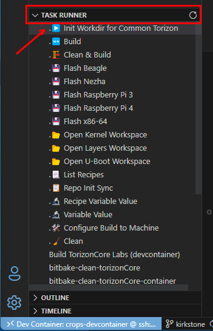
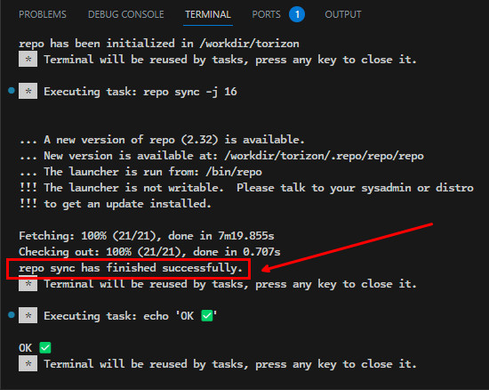
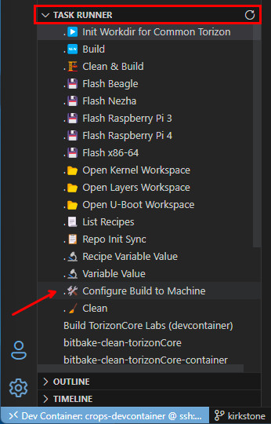
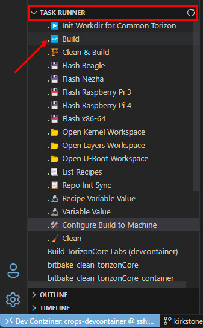

# HOW TO BUILD

General instructions on how to build the Common Torizon images.

## Prerequisites

- [git](https://git-scm.com/)
- [Docker](https://docs.docker.com/install/)
- [VS Code](https://code.visualstudio.com/)
- [Remote Containers VS Code Extension](https://marketplace.visualstudio.com/items?itemName=ms-vscode-remote.remote-containers)

## First Steps

> ➡️ These are non specific steps, they are required for all the machine targets.

Clone the follow repository

```bash
git clone https://github.com/commontorizon/commontorizon-manifest.git
```

This repository contains the manifest files to use with the [repo tool](https://gerrit.googlesource.com/git-repo/). Also this repo contains a VS Code `devcontainer` configuration with all the required tools to build the images.

> ⚠️ We recommend to use the VS Code `devcontainer` configuration, for the ease of use, but you can use the `repo` tool directly in your development machine too. Using directly the `repo` tool will need to you handle and install all the required dependencies in your development machine.

Open the repository in VS Code, a notification will be shown then click in the `Reopen in Container` button. This will build the container with all the required tools to build the images. The build of the docker image can take a while, but it will be done only once. After the build is done, the container will be in a VS Code connected to the container.


### Initializing the Workdir

This step will fetch all the repositories and checkout the correct branch for each one. To start run the `.▶️ Init Workdir for Common Torizon`, click in it label on the VS Code task runner list:



This will take a while, wait until the task is done. You will have a message like this on the terminal:



### Choosing the Machine Target

After the workdir is initialized, you need to choose the machine target to build the image. To do this, run the `.🛠️ Configure Machine and Image` task, click in it label on the VS Code task runner list:



This will open a list with all the available machine targets, choose the one you want to build the image, by clicking in it label or typing the name, or part of it, and pressing enter:


After the machine target is chosen, is also asked which kind of image you want to build, choose the `torizon-core-common-docker-dev` option:


### Building the Image

After the machine target is chosen, you can build the image. To do this, run the `.🆕 Build` task, click in it label on the VS Code task runner list:



> ⚠️ The first build will take a while, because all the dependencies will be downloaded and cached. This will depend on your internet connection and how powerful is your development machine. Remember you are building a Linux distribution from scratch, from source code, so it will take a while. Be patient.
